### Chat App via WebSockets + Redis + Spring Boot

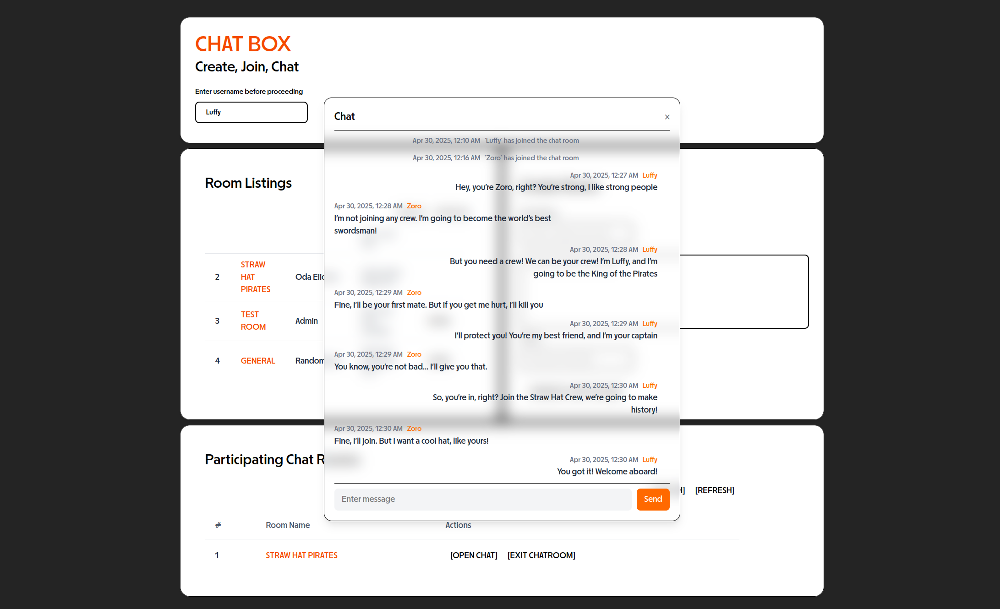

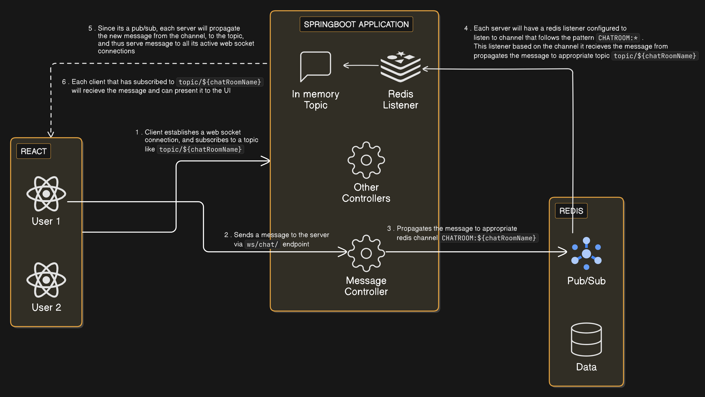

Flow:

> **Client connects to the server using WebSocket**

- The WebSocket handshake happens via a specific endpoint (e.g.`http://localhost:8080/api/chatapp/ws`).
- Spring boot enables this by configuring `WebSocketMessageBrokerConfigurer`  
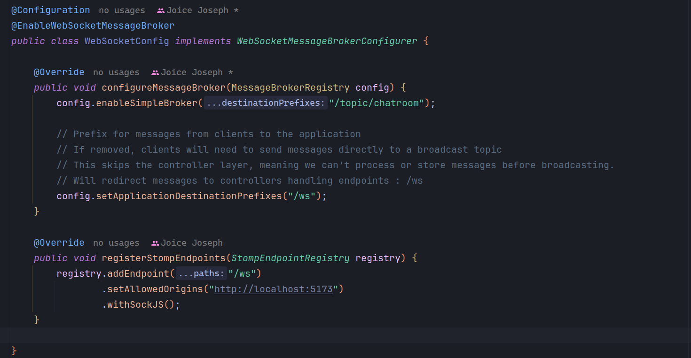

> **STOMP connection is established, and client subscribes to a topic**

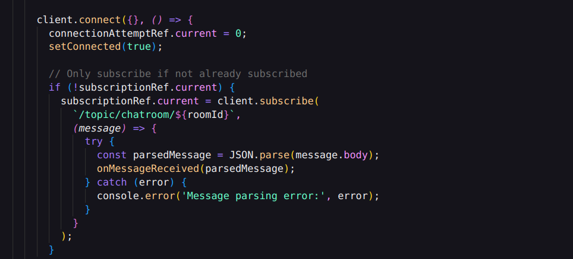

> **Client sends message to the server**

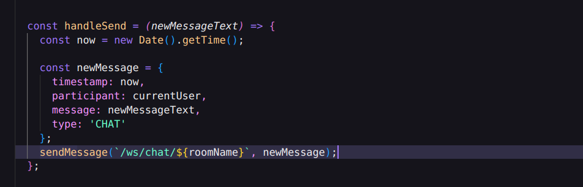  
Messages sent to `/ws/chat/**` are routed to Spring controller methods using `@MessageMapping`.  
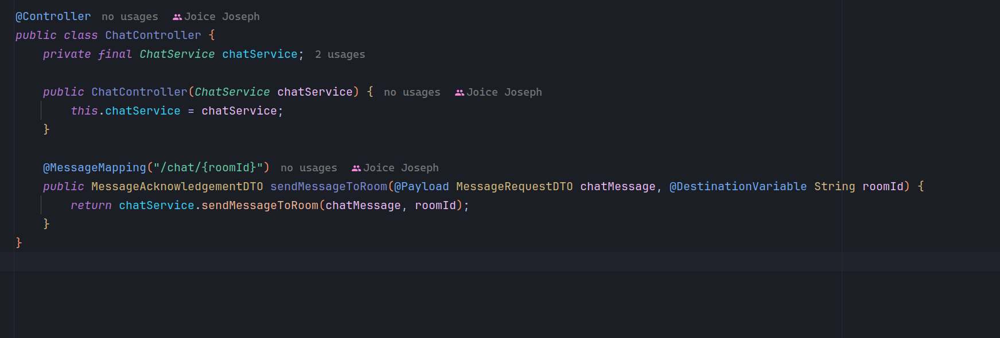

> **Spring Boot propagates the message to Redis channel**

Spring boot routes these messages through this controller, processes it, and sends it to the Redis channel.

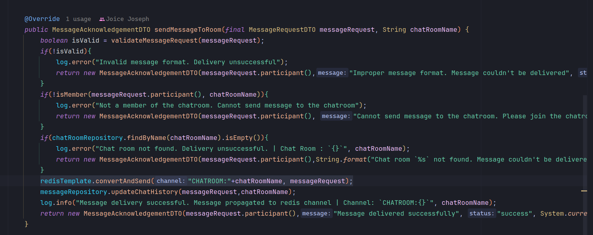

> **Redis Listener will receive messages from these channels and propagate it further to the topic that it is hosting in-memory**

Configure a Redis Listener that will get the message from the channel and send it to the topic  
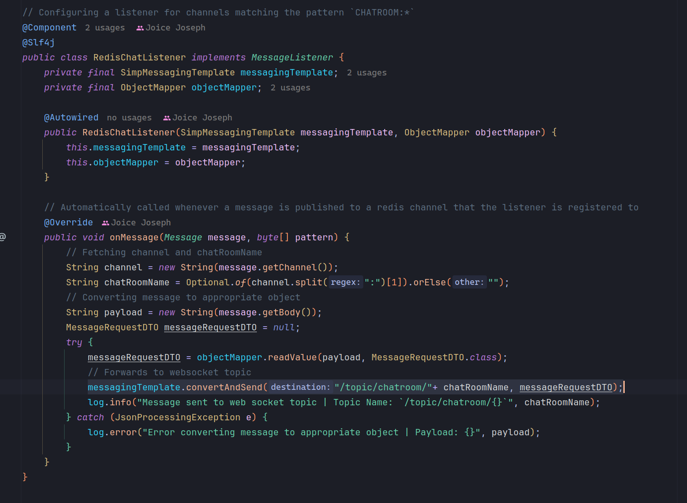  
Register the listener in Redis config  
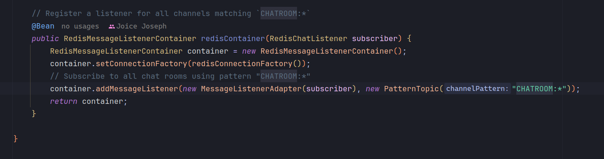

> **Client receives message through these topics, and can present them in the UI**

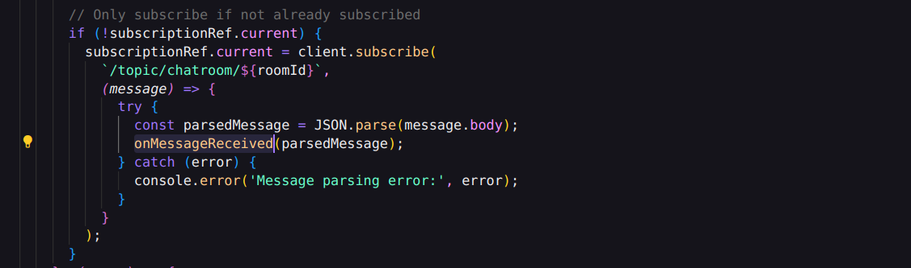

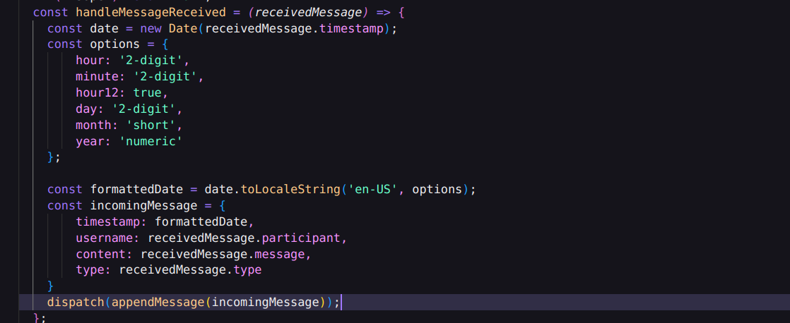

> **Besides this, APIs are configured that are used to create chat rooms, join, leave and delete. These APIs rely on Redis heavily to store all the metadata and the chat messages are also stored in Redis.**

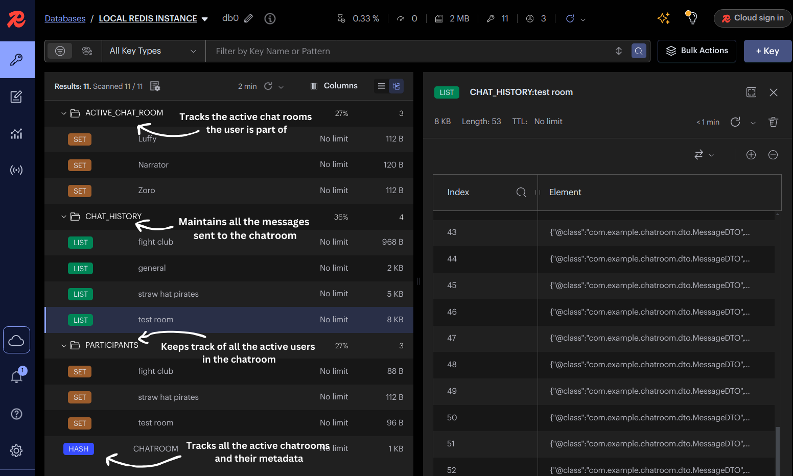
